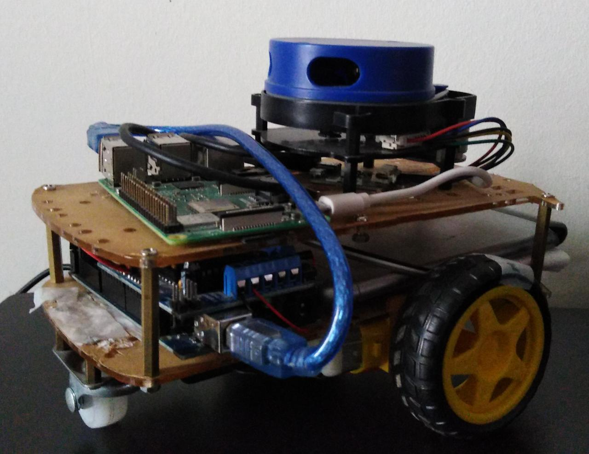

# **YDPIbot**

YDPIbot is an open platform differential drive mobile robot that uses a Raspberry Pi, an Arduino Mega, a YDLidar, a motor shield, an IMU, and encoders to perform autonomous navigation and mapping tasks. YDPIbot is an affordable and easy-to-assemble robot that is designed to be an educational tool for students and hobbyists who are interested in learning about robotics and autonomous systems.

---------------------------
# Assembly

To assemble YDPIbot, you will need the following components:

- Raspberry Pi 3 model B+
- YDLidar x4
- Arduino Mega
- Motor driver shield
- IMU (MPU6050)
- Optical encoders
- 2 DC motors
- 2 Wheels
- 1 Caster wheel
- Batteries with holder
- Power bank

Follow these steps to assemble YDPIbot:

1. Connect the Arduino Mega to the motor driver shield and the optical encoders and MPU6050 according to the pinout diagram provided in the documentation.
2. Connect the IMU to Raspberry Pi using the I2C interface and follow the instructions in the [mpu6050 pkg](https://github.com/PigeonSensei/pigeon_imu_driver/tree/master/mpu6050).
3. Mount the YDLidar on top of the robot using screws.
4. Mount the Raspberry Pi and the motor driver shield on the chassis of the robot using screws and standoffs.
5. Connect the DC motors to the motor driver shield and attach the wheels to the motor shafts.
6. Attach the optical encoders to the motors using the mountingbrackets provided in the kit.
7. Attach the caster wheel to the bottom of the robot chassis.
8. Install the batteries or power banks on the robot and connect them to the Arduino Mega and the motor driver shield.

---------------------------
# Installation

To use YDPIbot, you will need to install the following dependencies:

- [Python 3](https://www.python.org/downloads/)
- [Ubiquity Robotics image - Ubuntu 20.04](https://learn.ubiquityrobotics.com/noetic_pi_image_downloads) for rasberry pi
- [ROS Noetic](http://wiki.ros.org/noetic/Installation) - the ubiquity robotics image have ROS noetic already-
- [YDLidar pkg](https://github.com/PinkWink/ydlidar)
- [MPU6050](https://github.com/PigeonSensei/pigeon_imu_driver/tree/master/mpu6050)

---------------------------
### Installing Ubuntu20.04 on Raspberry PI

We recommend installing Ubuntu 20.04 and ROS noetic on the Raspberry Pi using the Ubiquity Robotics image. Follow these steps to install Ubuntu 20.04 using the Ubiquity Robotics image:

1. Download the Ubiquity Robotics image for Raspberry Pi from the [Ubiquity Robotics](https://learn.ubiquityrobotics.comnoetic_pi_image_downloads)

2. Flash the image to an SD card using a tool like Raspberry Pi Imager.

3. Insert the SD card into the Raspberry Pi and power it on.

4. Follow the on-screen instructions to complete the Ubuntu 20.04 installation process.

---------------------------
### Installing YDlidar pkg

To install the YDLidar pkg, follow these steps:

1. Open a terminal on your Raspberry Pi.

2. Clone the YDLidar repository using the following command:

    `git clone https://github.com/PinkWink/ydlidar.git`

3. Follow the instructions in the [README file](https://github.com/PinkWink/ydlidar) to build the YDLidar pkg.

4. Run some demo with the lidar to check if it's working.

---------------------------
### Installing MPU6050 pkg

To install the MPU6050 pkg, follow these steps:

1. Open a terminal on your Raspberry Pi.

2. Clone the MPU6050 repository using the following command:

    `https://github.com/PigeonSensei/pigeon_imu_driver/tree/master/mpu6050`

3. Install wiringPi library from [here](http://wiringpi.com/download-and-install/)

4. Run some demo with the IMU to check if it's working.

---------------------------
### Installing YDPIbot pkg

To install the YDPIbot package, follow these steps:

1. Open a terminal on your Raspberry Pi or PC.

2. Navigate to your `catkin_ws/src` directory

3. Clone the YDPIbot repository using the following command:

    `git clone https://github.com/AbdallahAmrBeedo/ydpibot.git`

4. Navigate back to the main catkin_ws to build the pkg using the command:

    `catkin_make`

---------------------------
### Uploading Arduino Code

1. Open Arduino IDE and connect the arduino to your PC

2. Choose from tools/boards Arduino Mega 2560 and choose the port (Usually **/dev/ttyACM0** if you are running from Ubuntu)

3. Open the code in `~/catkin_ws/src/ydpibot/ydpibot_bringup/YDPIbot/YDPIbot.ino`

4. Upload the code and connect the Arduino to the raspberry pi.

---------------------------
## Usage
For using the robot hardware, just open a terminal on the Raspberry pi and run the following command:

`roslaunch ydpibot_bringup robot.launch`

and wait until you see the massage `Sensors calibrated, Start!`

Now, you can run any other pkg to do anything!

---------------------------

For using the robot simulation, just open a terminal on the PC and run the following command:

`roslaunch ydpibot_description robot.launch`

Now, you can run any other pkg to do anything!

---------------------------
## Contributing

We welcome contributions from other developers! If you would like to contribute to YDPIbot, please follow these guidelines:

1. Fork the YDPIbot repository to your own GitHub account.
2. Create a new branch for your feature or bug fix.
3. Make your changes and test them thoroughly.
4. Submit a pull request to the main YDPIbot repository with a clear description of your changes.

---------------------------
## Credits

YDPIbot was created by Abdallah Amr, Mostafa Osama, Tarek Shohdy, and Yomna Omar from Egypt-Japan University of Science andTechnology. We would like to acknowledge the following libraries and tools that were used in the development of this project:

- [YDLidar SDK](https://www.ydlidar.com/products/view/5.html)
- [Adafruit Motor Shield library](https://learn.adafruit.com/adafruit-motor-shield/library-install)
- [Ubiquity Robotics Raspberry Pi Image](https://learn.ubiquityrobotics.comnoetic_pi_image_downloads)
- [MPU6050](https://github.com/PigeonSensei/pigeon_imu_driver/tree/master/mpu6050)

We would also like to thank the following people for their contributions to this project:

- Abdallah Amr (abdallah.amr@ejust.edu.eg)
- Mostafa Osama (mostafa.eshra@ejust.edu.eg)
- Tarek Shohdy (tarek.shohdy@ejust.edu.eg)
- Yomna Omar (yomna.mokhtar@ejust.edu.eg)

If you have any questions or feedback about YDPIbot, please contact us at abdallah.amr@ejust.edu.eg. We would love to hear from you!

---------------------------
## Future Work

- Add documentries (video - frames.pdf)
- Apply localizatin on gazebo simulation
- Odometry (options: try the encoders as it is, kalman filter between imu and encoders)
- Add reset odom service for the pose estimator
- Add Readme file for each pakage with how to use each one
- Add GUI for the bot